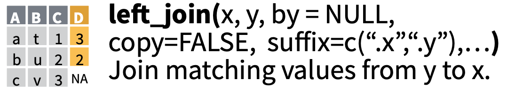

```{r setup, include=FALSE}
options(htmltools.dir.version = FALSE)
library(skimr)
hook_source <- knitr::knit_hooks$get('source')
knitr::knit_hooks$set(
  source = function(x, options) {
    x <-
      stringr::str_replace(x,
                           "^[[:blank:]]?([^*].+?)[[:blank:]]*#<<[[:blank:]]*$",
                           "*\\1")
    hook_source(x, options)
  }
)

```

```{css, echo = FALSE}

.huge .remark-code { /
  font-size: 150% !important;
}
.tiny .remark-code { 
  font-size: 50% !important;
}
.medium .remark-code { 
  font-size: 75% !important;
}
```

---

background-image: url("03_images/disclaimer.png")
background-position: center
background-size: contain

---

background-image: url("03_images/rcookbook.png")
background-position: center
background-size: contain

---
class: center, middle
# A Little About Me...

---

# Why am I doing this?

## Who's getting paid & how?

---
class: center, middle
# Why R? 

--

## Interactive

--

## Widely Used

--

## Data Analysis and Stats First

--

## Great Addon Packages (Tidyverse)

--

---

background-image: url("03_images/stats.jpg")
background-position: center
background-size: contain

---

background-image: url("03_images/google_ResearcHers.png")
background-position: center
background-size: contain

---

# What's up with the Tidyverse?

--

## Libraries that work well together

--

## Consistent Syntax

--

## Easier to Learn / Remember

--

## Sponsored by RStudio

---

# Tidyverse (core)

.pull-left[
## 👇 ***Our Focus Today***
### `dplyr` - data manupliation 
### `ggplot2` - visualization 
### `readr` - data import 
### `tidyr` - data rearrangement (tidy-ing)
]
.pull-right[
### `purrr` - functional programming with lists
### `tibble` - modern data frames
### `stringr` - string manipulation
### `forcats` - categorical data
]

---

background-image: url("03_images/konami.jpg")
background-position: center
background-size: contain

---

# Example Cheats

--
.pull-left[
## RStudio Add ins:
### `clipr` - output to clipboard
### `datapasta` - paste from clipboard
### `esquisse` - quick start graphs
]
--
.pull-right[
## Packages:
### `Tidyverse` - shared social norms
### `xlsx` - write to Excel

## Cheat Sheets:
### In the Help menu!
]

---

background-image: url("03_images/cheatsheets.png")
background-position: center
background-size: contain

---

background-image: url("03_images/dplyr_cheat.png")
background-position: center
background-size: contain

---

class: center, middle

# Let's Open<br/>`RStudio.cloud`

## http://bit.ly/fmh_r

Save the project to your workspace. 

---

background-image: url("03_images/rstudio.cloud.png")
background-position: center
background-size: contain

---

.center[
`ctrl + shift + n` - for new document


]

---

background-image: url("03_images/hello_yall.png")
background-position: center
background-size: contain

---

# Now your turn:


## Create a variable and shove some text into it with `<-`
## Then `print()` that to the screen


Save your script now. Update your script with each exercise. These are your notes for later. 
---

# Let's play with some data! 

---

```{r}
library(tidyverse)
```

---

```{r}
sob_limited_group_1 <- read_csv("01_data/sob_limited_group_1.csv")
```

---

# But what about equals signs?
```{r}
sob_limited_group_1 = read_csv("01_data/sob_limited_group_1.csv")
```


---

# But arrows are directional!
```{r}
read_csv("01_data/sob_limited_group_1.csv") ->
  sob_limited_group_1
```


---

# Control + Click on a data frame...

```r
View(sob_limited_group_1)
```

```r
sob_limited_group_1 %>%
   View
```

---

# wait.. wft is `%>%`?

--


---

# Why Pipes?

## Traditional Syntax
```r
harvest(
  spray(
    fertilize(
      plant( some_acres, crop = "corn", ppa = 38000),
        n = 10, p = 10, k = 10), 
    plan = "roundup")
  )
```
-or- 
```r
planted_acres <- plant( some_acres, crop = "corn", ppa = 38000)
fert_planted_acres <- fertilize(planted_acres, 
                                n = 10, p = 10, k = 10)
spray_fert_planted_acres <- spray(fert_planted_acres, 
                                  plan = "roundup")
harvest(spray_fert_planted_acres)
```

---
# Pipe Hotness

.huge[
```r
some_acres %>%
  plant(crop = "corn", ppa = 38000) %>%
  fertilize(n=10, p=10, k=10) %>%
  spray(plan = "roundup") %>%
  harvest() ->
  corn_crop
```
]
---
  
# Or in Kentucky
.huge[
```r
bourbon_bottle %>%
  open(twist=“left”) %>%
  pour(oz=4) %>%
  enjoy() ->
  bad_decisions
```
]

---

# Back to the data... 

---
# Type the data frame name into the console

```{r}
sob_limited_group_1
```
---
# Time to cheat... `↑↑↓↓←→←→BA`
```r
library(skimr)
```

--

.medium[
```{r highlight.output=c(11, 14)}

skim(sob_limited_group_1)

```
]

---

background-image: url("03_images/dplyr_wrangling.png")
background-position: center
background-size: contain


---

# `dplyr` verbs for manipulation

* `filter` - filter rows
* `select` - filter columns
* `mutate` - create new columns
* `group_by` - chunk that junk
* `summarize` - summery of each chunk
* `arrange` - sort order

---

# `filter` - filter rows

.medium[
```{r}
sob_limited_group_1 %>%
  filter(stAbbr == "IA" & cropName == "CORN") %>%
  skim
```
]

---

# `filter` supports nested parens

```{r, eval=FALSE}
sob_limited_group_1 %>%
  filter((stAbbr == "IA" & cropName == "CORN") |
           (stAbbr == "IL" & cropName == "SOYBEANS"))
```

The secret is: 
* `&` = and
* `|` = or

---

# `select` - pick columns

.medium[
```{r}
sob_limited_group_1 %>%
  filter((stAbbr == "IA" & cropName == "CORN") |
           (stAbbr == "IL" & cropName == "SOYBEANS")) %>%
  select(stAbbr, cropName)
```
]

---
# Exercise Time...

1. Take `sob_limited_group_1` and filter it to include all records for IA and MN, and only Corn for the rest of the states. 
1. keep only the following fields:
`year, stAbbr, coName, cropName, planAbbr, prem, indem`


5 minutes... use your post it notes
---

# Exercise Solution...            

--
.huge[
```{r}

sob_limited_group_1 %>%
  filter((stAbbr == "IA" | stAbbr == "MN") |
           (cropName == "CORN")) %>%
  select(year, stAbbr, coName, cropName, planAbbr, prem, indem) 

```  
]

---
# Double check: (bonus verb `distinct`)

```{r}

sob_limited_group_1 %>%
  filter((stAbbr == "IA" | stAbbr == "MN") |
           (cropName == "CORN")) %>%
  distinct(cropName, stAbbr) %>% 
  arrange( cropName, stAbbr)

```  

---

background-image: url("03_images/doing.gif")
background-position: center
background-size: contain

---

# `mutate` - create new columns           
.medium[
```r
dataframe %>%
  mutate( new_column = function(something) )
```
]

---

# `mutate` - create new columns           

```{r}
sob_limited_group_1 %>%
  filter((stAbbr == "IA" | stAbbr == "MN") |
           (cropName == "CORN")) %>%
  select(year, stAbbr, coName, cropName, planAbbr, prem, indem) %>%
  mutate(state_crop = paste(stAbbr, cropName)) #<<

```  

try it... 


---

# How to get help?

`?paste`

--

Google: R combine strings


---


# Bonus: `rename` - guess what it does?

--

```{r}

sob_limited_group_1 %>%
  select(year, stAbbr, coName, cropName, planAbbr, prem, indem) %>%
  rename(county_name = coName) #<<

```  
Notice the argument order...

---

# `group_by` - change the grouping (resolution) of future operations

```{r, highlight.output=c(2)}
sob_limited_group_1 %>%
  group_by(year, stAbbr)
```

---
# `summarize` - do a group operation on grouped data

```{r}
sob_limited_group_1 %>%
  group_by(year, stAbbr) %>%
  summarize( prem = sum(prem)) ->
  state_prem

state_prem

```
Be sure and assign this one to a data frame object. We'll need that in a minute. 
---

# Cool story, bro... how about a graph?
.huge[

`↑↑↓↓←→←→BA`
```{r, eval=FALSE}
install.packages("esquisse")
```

/ɛs.kis/

A quick first sketch of an idea.

`esquisse` gets us a fast first draft of a graph. It gives us `ggplot2` code we then customize. 
]
---


background-image: url("03_images/esquisse.png")
background-position: center
background-size: contain


---


```{r echo=FALSE, out.width=600}

```

```{r, echo=FALSE, out.width=600}

```

```{r, echo=FALSE, out.width=250}

```


---

# `esquisse` works best (only?) if you have your data aggregated to the unit of display

Generally this is true of `ggplot2` as well. 

---

# Let's talk about "long" vs "wide" data...

### If adding new data never adds columns, then your data is "long"

### Rule of thumb: keep your data long in storage and analysis until you ***really*** need it wide. Like to calculate correlations. 


---

# 🤔 - `ggplot` likes its data "long"

--

## Excel likes its data wide. 

--

This trips everybody up. 

---
# So how do we get make it a different shape?


## `pivot_wider`
## `pivot_longer`

---

# let's `pivot_wider`
```{r}
state_prem %>%
  pivot_wider(names_from = stAbbr, 
              values_from = prem) ->
  wide_prem
wide_prem
```

---
# Let's calculate correlations, since we can

```{r}
wide_prem %>%
  ungroup() %>% #<<
  select(-year) %>% #<<
  cor()

```

---
# let's reverse it with `pivot_longer`

```{r}
wide_prem %>%
  pivot_longer(cols = -year,
               names_to = "stAbbr",
               values_to = "prem")
```

---
```{r, eval=FALSE}
wide_prem %>%
  pivot_longer(cols = -year,
               names_to = "stAbbr",
               values_to = "prem")
```

## 🤔 - Two "gotchas" 

## 1. What's that `cols` argument? (it's like `select`)

## 2. Must quote the new field names

---

# Excel Pivot Tables do two things:

1. Aggregation
1. Reshaping 

--

# With R we do those in 2 different steps. 

1. `group_by` and `summarize`  (I'm counting these as one thing...)
1. `pivot_wider`  or  `pivot_longer`

--

💡 - `pivot_*` are brand spanking new & not in the cheatsheets yet - also not in *R Cookbook*

---
# Exercise Time! 

yellow Post Its up!

Start with the `sob_limited_group_1` data frame

Calculate combined corn & soy crop loss ratio by year. Loss ratio is `indem/prem`.

use `dplyr`-fu to get your data wrangled. 

Then create a `ggplot` point graph showing the LR by year. 

**BONUS:** Make the points scale with the LR 

15 minutes. 


---
# A Solution

```{r, eval=FALSE}

sob_limited_group_1 %>%
  filter(cropName %in% c("CORN", "SOYBEANS")) %>% #<<
  group_by(year) %>%
  summarize(lr = sum(indem) / sum(prem)) ->
  lr_year

ggplot(lr_year) +
  aes(x = year, y = lr, size = lr) +
  geom_point(colour = "#0c4c8a") +
 theme_minimal()

```

---
# A Solution

```{r, echo=FALSE}

sob_limited_group_1 %>%
  filter(cropName %in% c("CORN", "SOYBEANS")) %>% #<<
  group_by(year) %>%
  summarize(lr = sum(indem) / sum(prem)) ->
  lr_year

ggplot(lr_year) +
  aes(x = year, y = lr, size = lr) +
  geom_point(colour = "#0c4c8a") +
 theme_minimal()

```

---

# Can you make this a bar chart with `esquisse`?

---


# Maybe we should do some `ggplot`


---
# `ggplot` 
```{r, out.height=350, dpi=600}

ggplot(lr_year) +
  aes(x = year, y = lr, size = lr) +
  geom_point(colour = "#0c4c8a") +
  theme_minimal()

```
---

# that bar plot though...

```{r, out.height=300, dpi=600}

ggplot(lr_year) +
 aes(x = year, y = lr) +
 geom_bar(stat="identity") + #<<
 theme_minimal()

```

*R Graphics Cookbook* https://r-graphics.org/chapter-bar-graph

🤔 - Everybody trips on `stat="identity"`

---

# Joining data

## Very much like SQL joins (with better defaults)

### `inner_join` - only the matching data from both tables 
### `full_join` - all data from both tables
### `left_join` - all data from the left, and the matches from the right
### `right_join` - all data from the right, and the matches from the left

---
# Excel `vlookup` ...

## Imagine your starting table in Excel as your ***left*** table. Then a `vlookup` is like a `left_join`

## There is no `vlookup` that's like `full` or `inner` join

---

### `inner_join`


---

### `full_join`


---

### `left_join`





---

### `right_join`


---
# Inner Join Example

```{r}
sob_limited_group_1 %>%
  group_by(year, stAbbr, cropName) %>% #<<
  summarize(st_crop_yr_prem = sum(prem)) ->
  st_crop_yr_prem

sob_limited_group_1 %>%
  group_by(year, stAbbr, cropName, coName) %>% #<<
  summarize(st_crop_yr_co_prem = sum(prem)) ->
  st_crop_yr_co_prem
  
```

---

.tiny[
```{r, eval=FALSE}
st_crop_yr_co_prem %>%
  left_join(st_crop_yr_prem) 
```

```{r}
st_crop_yr_co_prem %>%
  left_join(st_crop_yr_prem, by = c("year", "stAbbr", "cropName")) 
```

]


---

# joins with missing values

```{r message=FALSE, warning=FALSE}
st_crop_yr_co_prem_missing <- 
  read_csv("01_data/st_crop_yr_co_prem_missing.csv")
```

Now we have `st_crop_yr_co_prem` and `st_crop_yr_co_prem_missing` which is the same but with 1000 random records missing (rows totally deleted)

How can we use joins to create a data frame of *only* the combinations of `year, stAbbr, cropName, coName` that are missing from `st_crop_yr_co_prem_missing`?

Post its up! Work in small groups. 

Hints:

* First step is to `ungroup()`
* Be explicit about your join `by = c('var1', 'var2')`
* notice what `dplyr` does if there's a column name clash
* Run results through `skim` for sanity check
* to filter on missing values, look at `?is.na`

---
# One Solution

.tiny[
```{r}
st_crop_yr_co_prem %>%
  ungroup() %>%
  left_join(st_crop_yr_co_prem_missing,
            by = c("year", "stAbbr", "cropName", "coName")) %>%
  skim
```
]

---

# One Solution cont...

.tiny[
```{r}
st_crop_yr_co_prem %>%
  left_join(st_crop_yr_co_prem_missing,
            by = c("year", "stAbbr", "cropName", "coName")) %>%
  filter(is.na(st_crop_yr_co_prem.y))
```
]

---

# Logical Branching

## the `dplyr` approach is the function


`case_when()`


## typically used along with a `mutate`

```r
mutate( new_column = case_when(condition ~ result, 
                               condition2 ~ result2, 
                               condition3 ~ result2,
                               TRUE ~ else_result) )
```
First `TRUE` condition is the result
---

# Logical Branching

```{r}

st_crop_yr_co_prem %>%
  mutate(size = case_when(st_crop_yr_co_prem >= 1000000 ~ "MM+", 
                           TRUE ~ "< MM"))

```

---
# Logical Branching

In "plinko" we need multiple conditions... use multiple pipe steps

.tiny[
```{r}

st_crop_yr_co_prem %>%
  mutate(size = case_when(st_crop_yr_co_prem >= 1000000 ~ "MM+",
                          TRUE ~ "< MM")) %>%
  mutate(size = case_when(st_crop_yr_co_prem >= 1000000 &
                            stAbbr == "IA" ~ "MM+ in IA")) -> 
  branch_example

branch_example %>%
  filter(st_crop_yr_co_prem >= 1000000) %>%
  head

branch_example %>%
  filter(st_crop_yr_co_prem >= 1000000) %>%
  tail

```
]
---
# Logical Branching FIXED! 

```{r}

st_crop_yr_co_prem %>%
  mutate(size = case_when(st_crop_yr_co_prem >= 1000000 ~ "MM+",
                          TRUE ~ "< MM")) %>%
  mutate(size = case_when(st_crop_yr_co_prem >= 1000000 &
                            stAbbr == "IA" ~ "MM+ in IA", 
                          TRUE ~ size)) -> #<<
  branch_example
branch_example %>%
  filter(st_crop_yr_co_prem >= 1000000) %>%
  tail

```

---
# Branching Exercise

Let's make a scoring "plinko"! Creaate a new column called `score` and use the following rules. You'll need multiple `caase_when` steps. Don't forget your `else` condition at the end of each one. Or you'll get an `NA`. Remember to use `==`. And ***add*** your change to the score to your existing score.

Rules:

* score starts at 0
* If it's IA Corn then add 1
* If it's MN Wheat then subtract 2
* If it's NE add 3
* If it's Soybeans subtract 1

---

# possible solution...


```{r}

st_crop_yr_co_prem %>%
  mutate(score = 0) %>% 
  mutate(score = case_when( stAbbr == "IA" & cropName == "CORN" ~ score + 1 , 
                            TRUE ~ score) ) %>%
  mutate(score = case_when( stAbbr == "MN" & cropName == "WHEAT" ~ score - 2  , 
                            TRUE ~ score) ) %>%
  mutate(score = case_when( stAbbr == "NE"                       ~ score + 3  , 
                            TRUE ~ score) ) %>%
  mutate(score = case_when( cropName == "SOYBEANS"               ~ score - 1  , 
                            TRUE ~ score) ) ->
  solution_df
  
solution_df %>%
  ungroup() %>%
  summarize(score = sum(score))

```

---
# Plinko Warning...

## Using a table and a join is more maintainable

---
# Export to fixed width

`readr` package is the fast tidyvere way to read/write data: `readr::write_*`

However...


---

# Export to fixed width

so I googled...


Let's try it! 

`install.packages("gdata")`

---
# gdata::write.fwf

```{r message=FALSE, warning=FALSE}
library(gdata)

head(st_crop_yr_prem) 

st_crop_yr_prem %>%  
  as.data.frame() %>% # <<
  write.fwf(file = "test.fwf",
            colnames = FALSE,
            width = c(4, 2, 25, 15))

```
---

# Reading and writing from Excel

https://rc2e.com/inputandoutput#recipe-readexcel

https://rc2e.com/inputandoutput#recipe-writeexcel

---

# Learn More!

## *R Cookbook - 2nd ed.* - http://rc2e.com

## *R for Data Science* - https://r4ds.had.co.nz

## *R Graphics Cookbook - 2nd ed.* - https://r-graphics.org

---

# James (JD) Long

## Personal EMail - jdlong@gmail.com

## Twitter: @CMastication

---

# Artwork by @allison_horst


---

# Bonus Cheats... `↑↑↓↓←→←→BA`

## Interactive and debugging:

`library(clipr)` - copying R object contents to clipboard

`library(datapasta)` - pasting data into R scripts

---


